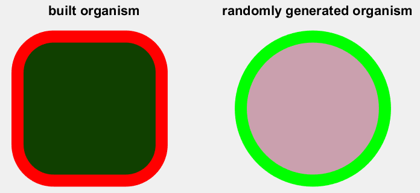
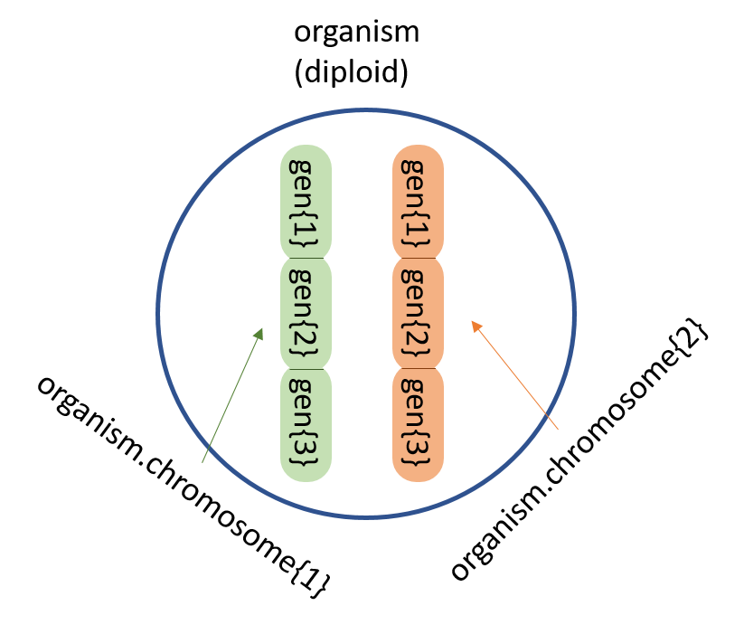
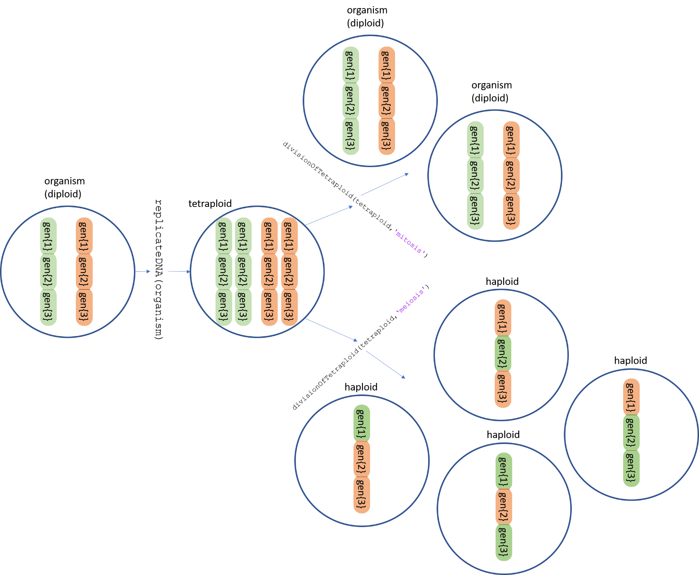
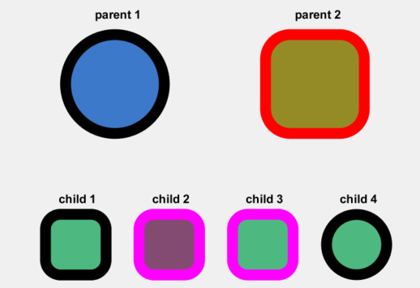

Mitóza a meióza
===============

Tato úloha slouží k pochopení základních procesů probíhajících při
buněčném dělení především z hlediska genetiky. Úkolem je v MATLABu
doprogramovat sadu podpůrných funkcí a funkce pro meiózu a mitózu.

Popis úlohy
-----------

Pro demonstraci fungování buněčného dělení složí ukázkový jednobuněčný
organismus. Tento organismus je pro snadnější pochopení a implementaci
značně zjednodušen. Obsahuje pouze jeden pár chromozomů (v diploidním
stavu má tedy 2 chromozomy). Na každém chromozomu figurují tři geny.
Každý gen je zodpovědný za jednu vlastnost (barva, tvar, barva okraje).
Organismus se může rozmnožit nepohlavně (mitoticky) i pohlavně
(využívaje meiózu) a to i přes to, že nemá žádný znak zodpovědný za
pohlaví (u člověka je tímto znakem na genetické úrovni chromozom X a Y).
Součástí zadání je implementovaný kód pro tvorbu náhodného organismu
(*getRandomOrganism*) a funkce pro vykreslení organismu
(*drawOrganism*). Použití těchto funkcí je v souboru *SCRIPT.m*, který
slouží jako spouštěč a rozcestník pro ostatní funkce.

*Obr. 1: Dva vykreslené organismy. V genech zakódované vlastnosti pro
tento organismus jsou tvar, barva a barva okraje.*

Zadání
------

Doprogramujte funkce: *mitosis, meiosis, divisionOfTetraploid,
replicateDNA, sexualReproduction*. Funkce na sebe jistým způsobem
navazují. K dispozici jsou hlavičky funkcí a komentáře vystihující
přibližnou implementaci. Popis struktur a návazností funkcí je
v následujících částech dokumentu. Důležité je pochopit, jak procesy
buněčné reprodukce fungují.

Popis organismu
---------------

Organismus se v diploidním stavu skládá ze dvou chromozomů, každý
chromozom obsahuje tři geny. Následující obrázek odpovídá struktuře
v MATLABU ve které je organismus uložen.

*Obr. 2: Popis organismu*

Popis funkcí 
-------------

Funkce přibližně odpovídají jednotlivým dějům při buněčném dělení:

*Obr. 3: Navržené funkce pro buněčné dělení*

Pohlavní rozmnožení organismu
-----------------------------

Funkce *sexualReproduction* bude implementovat pohlavní rozmnožování
organismů. Bude zde volána funkce *meiosis* pro tvorbu haploidních
buněk. Volání funkce a vizualizace výsledků je již naprogramovaná
v souboru SCRIPT.m.

*Obr. 4: Vizualizace pohlavního rozmnožování organismů*
